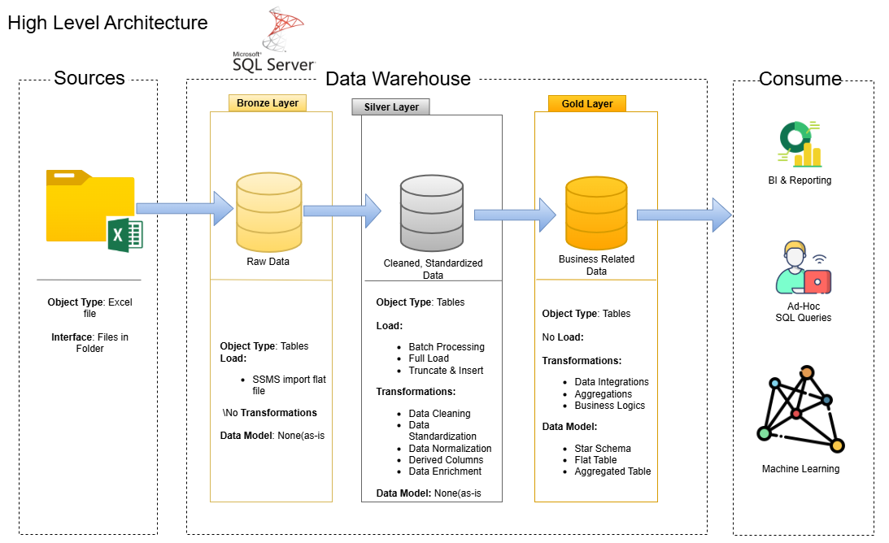
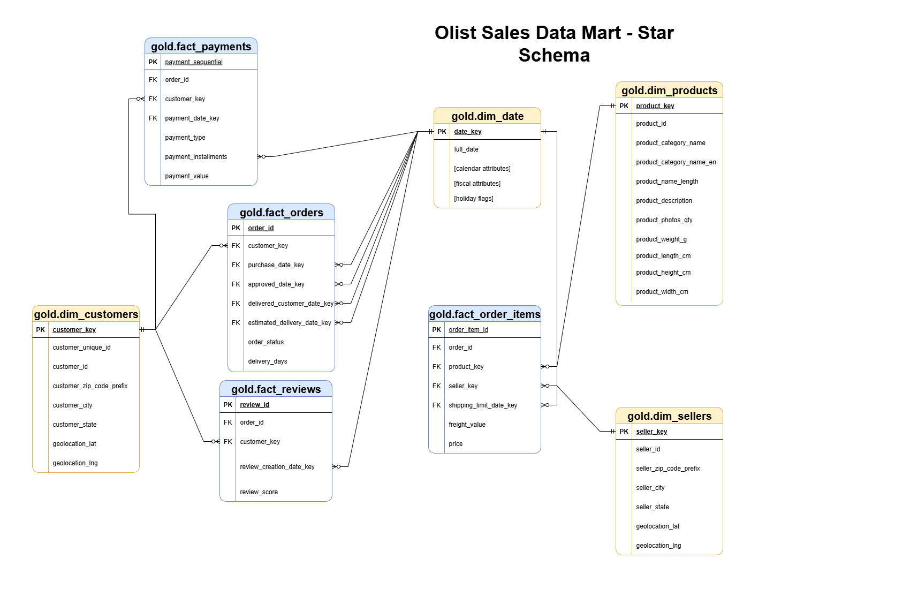
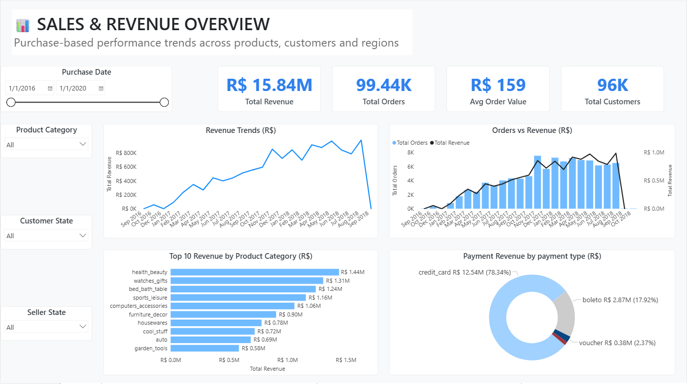
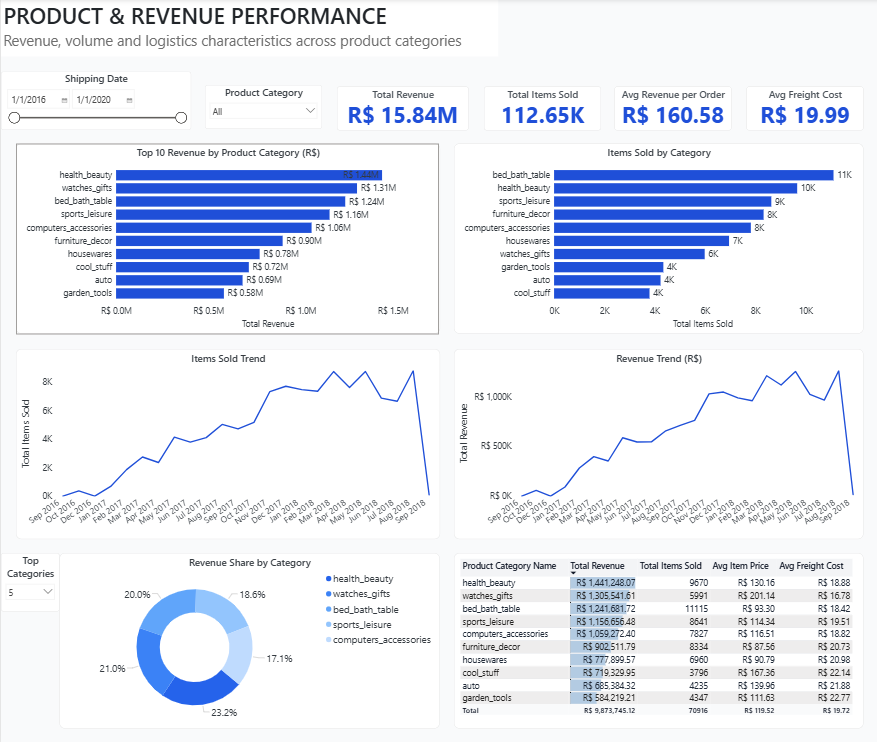
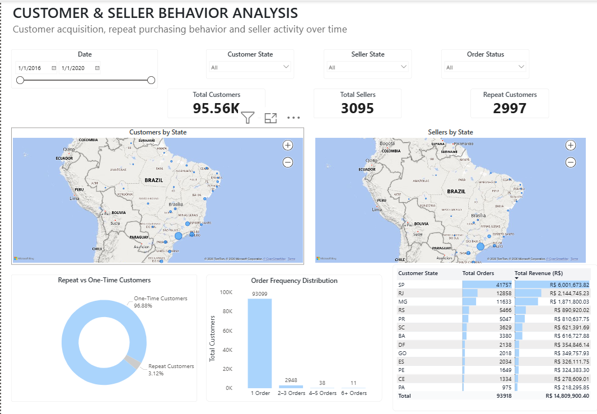
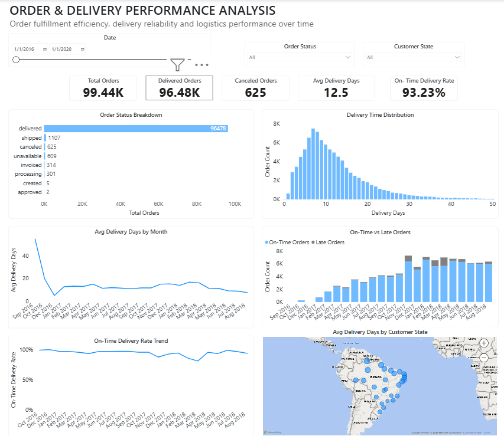

# 📊 Olist E-Commerce Data Analytics Pipeline

**End-to-End SQL & Power BI Analytics Project**

---

## ⚡Executive Summary

This project demonstrates how I transform **raw e-commerce data into actionable business insights** using SQL, dimensional modeling, and Power BI.

I designed a **multi-layer analytics pipeline (Bronze → Silver → Gold)**, built a **star-schema data model**, and developed **four interactive dashboards** answering real business questions around **revenue growth, product performance, customer behavior, and delivery efficiency**.

The analysis reveals that:

* A small number of product categories drive most revenue
* Customer retention is a major growth opportunity
* Freight costs and delivery delays materially affect profitability and customer experience

This project reflects how a **Data Analyst operates in a real business environment**, turning data into insights that support **strategic and operational decisions**.

---

## 📑 Table of Contents

* [Project Overview](#-project-overview)
* [Architecture & Data Pipeline](#-architecture--data-pipeline)
* [Data Modeling](#-data-modeling)
* [Analytics & Dashboards (Power BI)](#-analytics--dashboards-power-bi)
* [Results & Key Insights](#-results--key-insights)
* [Key Recommendations](#-key-recommendations)
* [DAX Measures & Business Logic](#-dax-measures--business-logic)
* [Exploratory & Analytical SQL](#-exploratory--analytical-sql)
* [Business Questions Answered](#-business-questions-answered)
* [Tools & Technologies](#-tools--technologies)
* [Author](#-author)

---

## 🚀 Project Overview

This project analyzes the **Brazilian Olist e-commerce dataset** to uncover insights across **sales, products, customers, sellers, and delivery operations**.

It follows a **professional analytics workflow**:

* Structured SQL transformations
* Clean, well-modeled data
* Business-focused KPIs
* Clear, decision-ready dashboards

The goal is not just visualization, but **insight generation and decision support**.

---

## 🧱 Architecture & Data Pipeline

### Overall Data Architecture

The solution follows a **Bronze → Silver → Gold** architecture to ensure data quality, scalability, and trust in reporting.

* **Bronze:** Raw ingestion (no transformations)
* **Silver:** Cleaning, standardization, enrichment
* **Gold:** Analytics-ready tables optimized for Power BI

---

## 🗂️ Data Modeling

### Star Schema Design

The model uses **fact and dimension tables** aligned with common business questions:

* Orders, items, payments (facts)
* Customers, sellers, products, dates, geography (dimensions)

This structure enables:

* Accurate aggregations
* Clear filtering
* Fast analytical queries

---

## 📈 Analytics & Dashboards (Power BI)

### Dashboard 1 – Sales & Revenue Overview

**Answers:**

* How is revenue trending over time?
* Which categories generate the most revenue?
* How do customers pay?

---

### Dashboard 2 – Product & Revenue Performance

**Answers:**

* Which products and categories drive performance?
* How do freight costs affect revenue?
* Where does volume not translate into value?

---

### Dashboard 3 – Customer & Seller Behavior

**Answers:**

* How many customers are repeat buyers?
* What is the revenue per customer?
* How active are sellers on the platform?

---

### Dashboard 4 – Order & Delivery Performance

**Answers:**

* How efficient is order fulfillment?
* How often are deliveries late?
* What is the average shipping cost per order?

---

## 📊 Results & Key Insights

### 📈 Revenue & Sales

* Revenue is **highly concentrated in a small number of product categories**, indicating dependency risk.
* Month-over-month trends reveal **seasonality**, useful for campaign planning.
* Large AOV differences across categories suggest **pricing and bundling opportunities**.

### 📦 Product & Freight Performance

* Freight costs significantly erode margins for **low-priced, high-volume products**.
* Heavier and bulkier products produce **lower revenue per kilogram**, highlighting logistics inefficiencies.

### 👥 Customer Behavior

* The majority of customers are **one-time buyers**, limiting long-term growth.
* Repeat customers generate **much higher revenue per customer**, making retention critical.

### 🚚 Delivery & Operations

* While most orders are delivered, **late deliveries remain a consistent issue**.
* Delivery performance varies by region, suggesting **geographic bottlenecks**.

---

## 🧭 Key Recommendations

*(This section is intentionally written the way a Data Analyst would present findings to stakeholders.)*

1. **Invest in Customer Retention**

   * Introduce loyalty programs and targeted re-engagement for one-time buyers
   * Focus marketing spend on converting high-value repeat customers

2. **Optimize Product & Category Strategy**

   * Reduce reliance on a few top categories by nurturing mid-tier performers
   * Bundle low-margin products with higher-margin items to improve AOV

3. **Review Freight & Logistics Costs**

   * Reassess pricing for heavy or bulky products
   * Explore regional fulfillment strategies to reduce late deliveries

4. **Use On-Time Delivery as a Performance KPI**

   * Track on-time delivery rate by region and seller
   * Prioritize operational improvements where customer experience is most impacted

📌 These recommendations are **directly supported by the dashboards and metrics** in this project.

---

## 🧮 DAX Measures & Business Logic

**Path:** `powerbi/dax_measures/`

Measures are designed to be:

* Reusable across dashboards
* Context-aware
* Aligned with business KPIs

Includes:

* Revenue, AOV, MoM growth
* Customer repeat rate
* Delivery performance metrics

---

## 🔍 Exploratory & Analytical SQL

**Paths:**

* `sql/01_EDA`
* `sql/02_analytics`

Used to:

* Validate data quality
* Explore distributions and outliers
* Confirm business assumptions before dashboarding

---

## 🧠 Business Questions Answered

Documented in:

* `docs/business_questions.md`

Examples:

* What drives revenue growth?
* Which customers are most valuable?
* Where are operational inefficiencies occurring?
* How does logistics impact customer experience?

---

## 🛠️ Tools & Technologies

* **SQL Server**
* **Power BI**
* **DAX**
* **Dimensional Modeling**
* **Git & GitHub**

---

## 📌 Author

**Odoh Kenneth**
Data Analyst
Turning data into **clear, actionable business insights**

---
